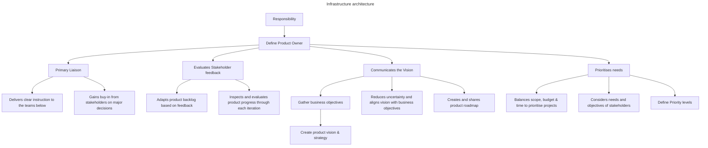

```mermaid
---
title: Infrastructure architecture
---

flowchart TD
    A[Responsibility] --> B[Define Product Owner]
    B --> C[Primary Liaison]
    B --> D[Evaluates Stakeholder feedback]
    B --> E[Communicates the Vision]
    B --> F[Prioritises needs]

    C --> G[Delivers clear instruction to the teams below]
    C --> H[Gains buy-in from stakeholders on major decisions]

    D --> I[Adapts product backlog based on feedback]
    D --> J[Inspects and evaluates product progress through each iteration]

    E --> K[Gather business objectives]
    K --> L[Create product vision & strategy]
    E --> M[Reduces uncertainty and aligns vision with business objectives]
    E --> N[Creates and shares product roadmap]

    F --> O[Balances scope, budget & time to prioritise projects]
    F --> P[Considers needs and objectives of stakeholders]
    F --> Q[Define Priority levels]

```
