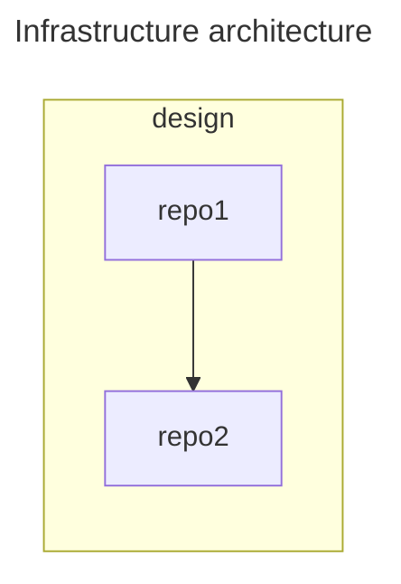

```mermaid
---
title: Infrastructure architecture
---

flowchart LR
    subgraph design
        repo1 --> repo2
    end

    click repo1 href "https://github.com/org/repo1" _blank
    click repo2 href "https://github.com/joebywan/learning_paths/blob/ops/built_in_content/operations_model/test.md" _blank
```
