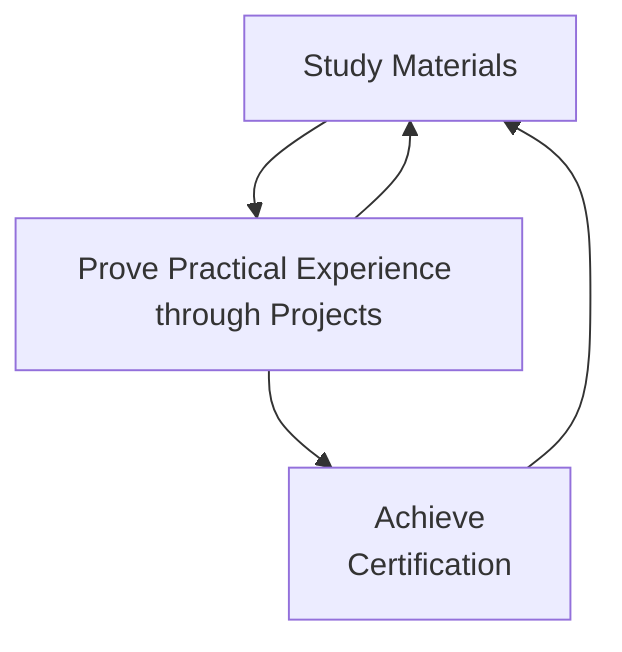

# IT Learning Paths  

## Table of Contents  
- [IT Learning Paths](#it-learning-paths)
- [Table of Contents](#table-of-contents)
- [Why is this here?](#why-is-this-here)
- [Why Follow These Pre-Built Guides?](#why-follow-these-pre-built-guides)
- [Recommended Study Flow](#recommended-study-flow)
- [Learning Paths](#learning-paths)
- [Other advice](#other-advice)

---

## Why is this here?  

The goal is to create repeatable patterns for engineers to follow a structured path to acquire the skillsets needed for various IT positions. These learning paths are designed to target beginner or associate levels, allowing those with more experience to skip ahead if they’ve already mastered the content. Even if you are experienced, it’s worth exploring the material to uncover potential gaps in your knowledge that may have been overlooked.  

---

## Why Follow These Pre-Built Guides?  

Participating in these pre-baked learning paths provides a streamlined and efficient way to develop in-demand skills, ensuring you stay aligned with industry expectations. By following a cookie-cutter path, you’ll benefit from:  

- **Clear direction and focus:** Avoid confusion with a structured, step-by-step guide for mastering core topics.  
- **Efficient learning:** Save time by following pre-curated content tailored to career roles and industry certifications.  
- **Consistency and repeatability:** Develop predictable expertise that aligns with specific career paths and job requirements.  
- **Skill gap identification:** Even experienced professionals can discover areas for growth they may have missed.  
- **Career advancement:** Build a solid foundation to prepare for certifications and future career moves.  

These learning paths take the guesswork out of figuring out what to learn next, ensuring you focus your efforts where they’ll have the most impact.

---

## Recommended Study Flow  

The way to study that works for me is to do some reading on the topic. Use that to build something. Rinse and repeat until I'm comfortable enough to work on practice exams and complete a certification.

### Learning Paths
- [Operations](./learning_paths/operations/operations.md)

### Other advice
- [How to ask a question](./generic_advice/how_to_ask_a_question.md)
